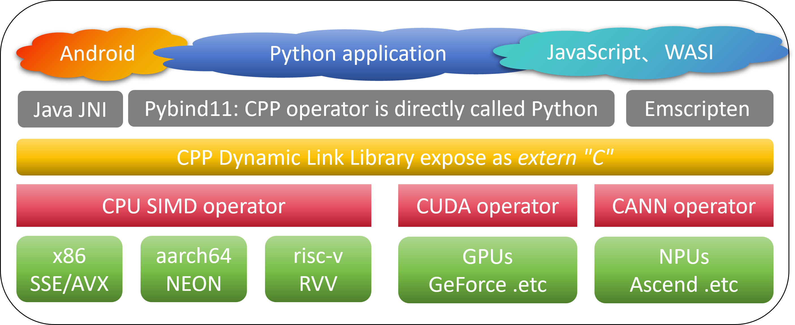

中文|[English](README.md)

# 针对异构计算系统的算子开发模板

并行加速高性能计算的发展路径是类似的，以华为为例，先有Ascend NPU硬件，然后有对应汇编instructions的c语言封装ccec(Cube-based Computing Engine C)，接着套一层Ascend C抽象来屏蔽底层硬件差异。毕昇本来就是基于LLVM的，定义一个MLIR方言适配[Ascend NPU IR](https://gitee.com/ascend/ascendnpu-ir)算是众望所归。华为毕昇编译器在做类似的[AscendNPU IR，支持Triton、FlagTree等三方生态接入，提供搬运、计算、内存三大类高阶OP](https://www.bilibili.com/video/BV1NCTsz1EwK/)。

| 架构 | 汇编 | 编译器     | 调试调优工具                | 中间表示语言          |
|------|---------|--------------|----------------------|----------------------|
| CPU  | asm     | gcc          |       IDE               | LLVM                 |
| GPU  | ptx     | nvcc         | cuda-gdb & Insight   | [MLIR dialect for GPU](https://mlir.llvm.org/docs/Dialects/GPU/) |
| NPU  | bin     | ccec bisheng | msdebug & MindStudio | Ascend NPU IR        |

[本项目](https://github.com/Tridu33/OperatorsDevTemplate/tree/main)分别用最基础的TensorAdd作为示例介绍“Python未皮，C++为翼”的算子开发调用流程，更多算子先考虑现有算子没有再魔改模板甚至自行根据算法重写：

- CPU，[更多CPU量化算子参考llamafile](https://github.com/Mozilla-Ocho/llamafile/tree/main/llama.cpp)，需了解x86的AVX指令集和arm64的NEON指令集用法等知识；
- CUDA.cu for GPU，[更多GPU推理算子参考CUDA官方samples](https://github.com/NVIDIA/cuda-samples/tree/master/Samples)、[樊哲勇老师的书籍《CUDA-Programming编程》](https://github.com/brucefan1983/CUDA-Programming)和[CUDA_kernel_Samples](https://github.com/Tongkaio/CUDA_Kernel_Samples)类似案例集，需了解CUDA和pyCUDA并行开发；
- Ascend NPU，[更多NPU推理算子参考官方案例](https://github.com/Ascend/samples/tree/master/cplusplus/level1_single_api/4_op_dev/1_custom_op)和[B站起飞的老谭](https://space.bilibili.com/668461244?spm_id_from=333.337.0.0)等资料，需了解TBE,pyACL,OMl量化推理算子库等Ascend系前置知识，按需寻找或者自行重写。[苏统华老师的书籍《AscendC异构程序设计-昇腾算子设计指南》随书代码和PPT](https://box.lenovo.com/l/8uf9SX)。CANN算子有几种开发方式：TBE DSL、TBE TIK、AI CPU和**Ascend C**。针对全新开发的算子只推荐用最新的Ascend C，在进行代码开发前，首先需要选择合适的算子实现方式。开发或者迁移算子之前需要先查询[AI框架算子清单和CANN算子清单](https://www.hiascend.com/document/detail/zh/canncommercial/80RC1/apiref/operatorlist/operatorlist_0000.html)
等ascend 算子全家桶： https://gitee.com/ascend/cann-hccl 、
https://gitee.com/ascend/ascendc-api-adv 、
https://gitee.com/ascend/cann-ops 、
https://gitee.com/ascend/cann-ops-adv 、
https://gitee.com/ascend/catlass 、
https://gitee.com/ascend/ascend-transformer-boost 、
https://gitee.com/ascend/samples 。

- 其他语言实现的算子：图灵完备的编程语言能实现的算法能力是一样的，一般HPC为适配硬件高性能计算，常采用cpp实现算子。原生python写的算子不需要pybind11，Triton最初是CUDA更简易用法的封装后来成为一种中间表示，[Triton官方tutorials](https://github.com/triton-lang/triton/blob/main/python/tutorials/01-vector-add.py)和[Awesome-Triton-Kernels](https://github.com/zinccat/Awesome-Triton-Kernels)， 科学计算领域也会考虑[用Julia实现算子](https://www.mindspore.cn/tutorials/zh-CN/r2.6.0/custom_program/operation/op_custom_julia.html)。JAX是autograd+XLA在纯函数微分编程的AI框架试验田，类比PyTorch,MindSpore,Tensorflow等存在，FP编程哲学在于可组合性足够灵活，比如[cuda+cpp写算子pybind11封装一个算子给调用](https://jax.ac.cn/en/latest/Custom_Operation_for_GPUs.html)。

## Python AI框架和底层算子是解耦的

1. CopyIn任务: 输入H2D指针乱飞传递给底层异构算子;
2. Compute任务: 自动(llama.cpp等推理引擎主流做法是后端优先级根据可用性自动选择后端)或者手动(ktransformers使用yaml手工指定MoE具体结构到异构设备)指派dispatch计算图中任务到异构计算结构具体算子.so中执行;
3. CopyOut:任务 最后把计算结果通过D2H返回Python调用方即可;

本项目首先介绍pybind11调用cpp并调试；然后介绍cuda和cpp算子是如何在GPU机器上绑定并使用的；然后介绍AscendNPU算子开发入门。类似[oppenmlsys中简单介绍了MindSpore先注册一个算子接口然后用类似的方法dispatch到CPU,GPU,NPU多端实现的理论](https://github.com/openmlsys/openmlsys-zh/blob/main/chapter_programming_interface/c_python_interaction.md)的具体实践代码，实际开发步骤可参考[官网自定义算子的教程](https://www.mindspore.cn/docs/zh-CN/r2.5.0/model_train/custom_program/op_custom.html)：

- 算子原语注册=声明一个接口行为描述，后面对接CPU,GPU,NPU各种后端
- 书写GPU/CPU/Ascend NPU算子
- 注册算子pybind11绑定函数

## 「现在是幻想时间」
so/dll跨语言调用主要做的是IO数据类型映射转换：pybind11把常见cpp STL data structure映射为numpy等，JNI暴露so给Android java调动同理，Pybind11框架是为了映射数据类型，传递IO数据。

>香橙派推出AI Studio Pro 训推一体人工智能算力卡，其拥有 352TOPS 算力、将支持 Windows 系统，OrangePi AI Studio Pro 采用昇腾 AI 技术路线，融合“ARM core、Al core、Vector core、Image core”于一体，提供“基础通用算力 + 超强 AI 算力 + 编解码核心”，可满足训推一体 AI 任务需求，拥有 96GB / 192GB LPDDR4X，速率达 4266Mbps。淘宝非Pro版本是48G， 即 4个设备规格 都是48G的倍数 ， 48G  96G， 196G，最高规格的可能就是 双卡 300I DUO，也就是4个 300I ，每个48G 。

AI Studio Pro做成usb4扩展坞的形式大概率是考虑到将来兼容多平台和可扩展，然后用雷电口实现多机可扩展，linux win macos都能用。SPIR-V是多个 Khronos API 共用的中间语言，包括 Vulkan, OpenGL, 以及 OpenCL。如果Ascend NPU之上抽象出一个符合SPIR-V标准的中间表示语言，然后可以绑定到ffmpeg.js或者webGL，做出来类似webGPU的效果，绑定到云原生的应用上。会不会有一天,当我的个人电脑USB插上OrangePi AI Studio Pro，查看后台显示“QQ内嵌的虚幻引擎正在使用NPU做并行加速计算图像渲染”？
